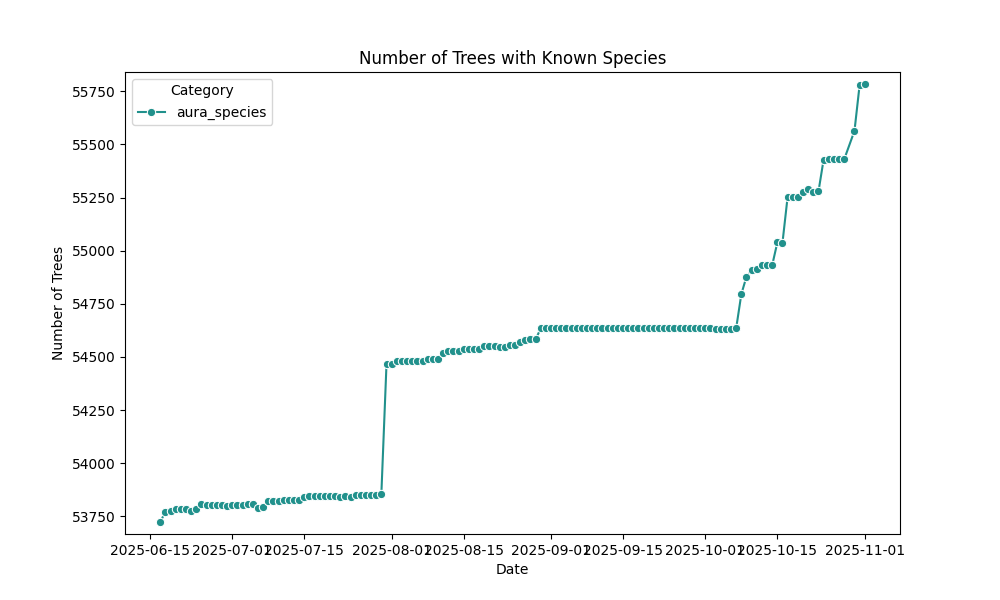
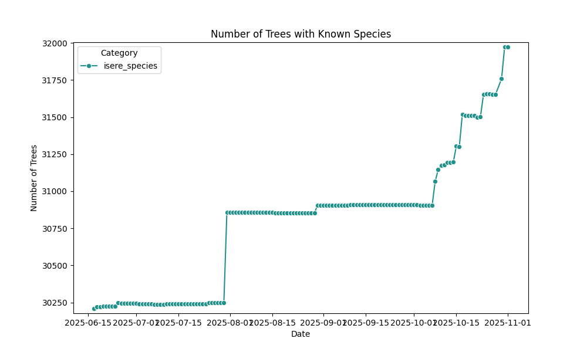
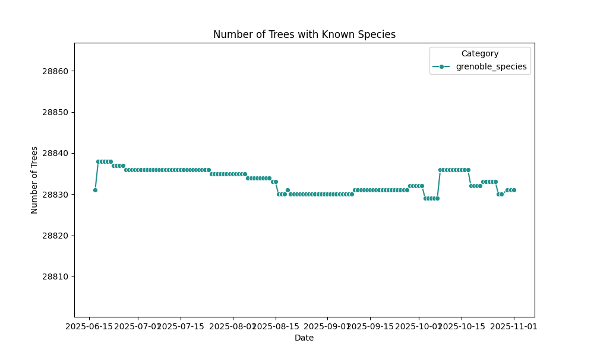
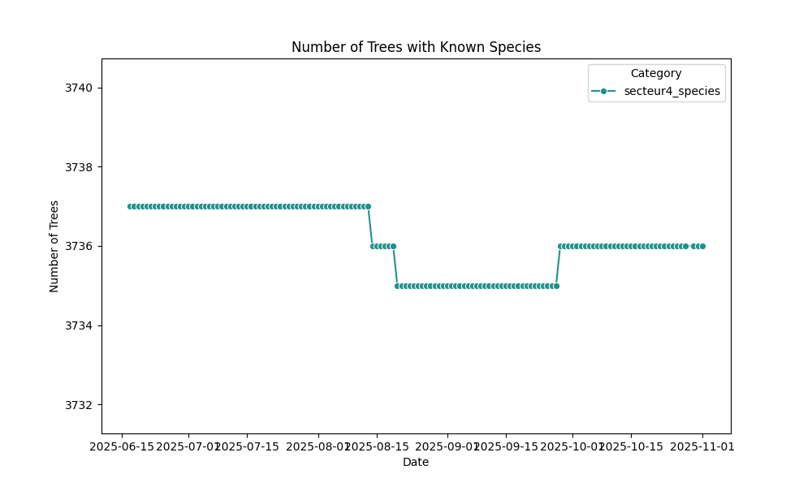
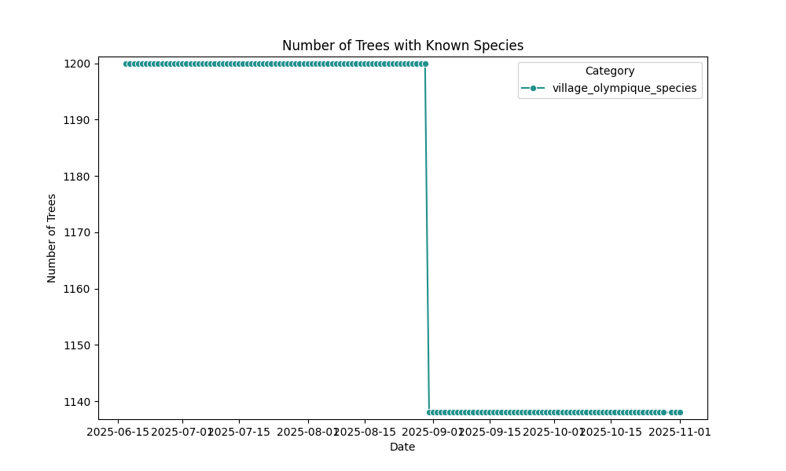
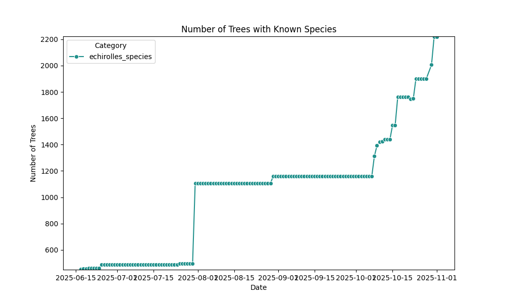
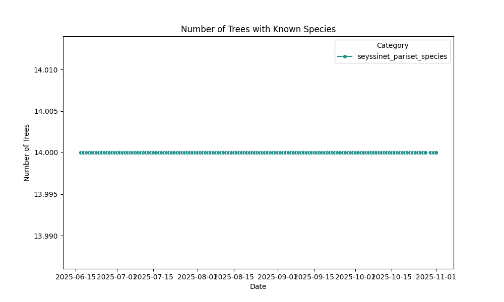

# osm-tree-stats
Statistics about trees on OpenStreetMap

## France

## Auvergne-Rhône-Alpes

## Isère

## Grenoble-Alpes-Métropole

## Grenoble

### Secteurs

#### Secteur 1

#### Secteur 2

#### Secteur 3

#### Secteur 4

#### Secteur 5

#### Secteur 6

### Quartiers

#### Teisseire

#### Malherbe

#### Villeneuve

#### Vigny-Muset

#### Village Olympique

## Echirolles

## Eybens

## Saint-Martin-d'Hères

## La Tronche

## Fontaine

## Seyssinet-Pariset

## Seyssins

