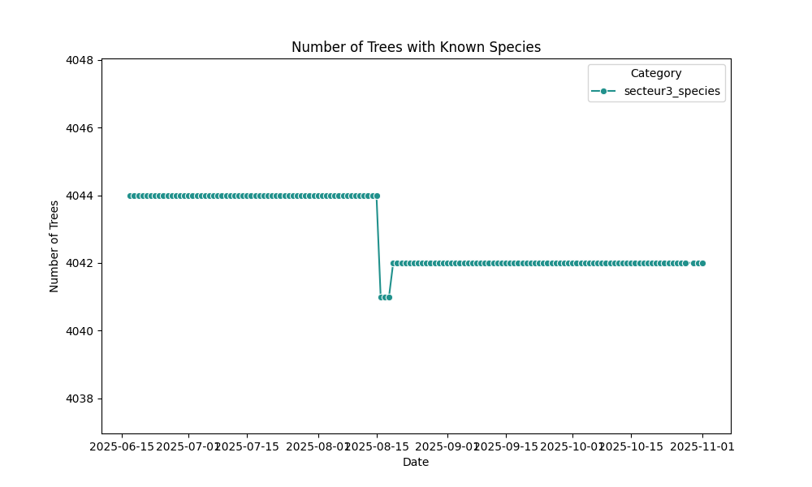
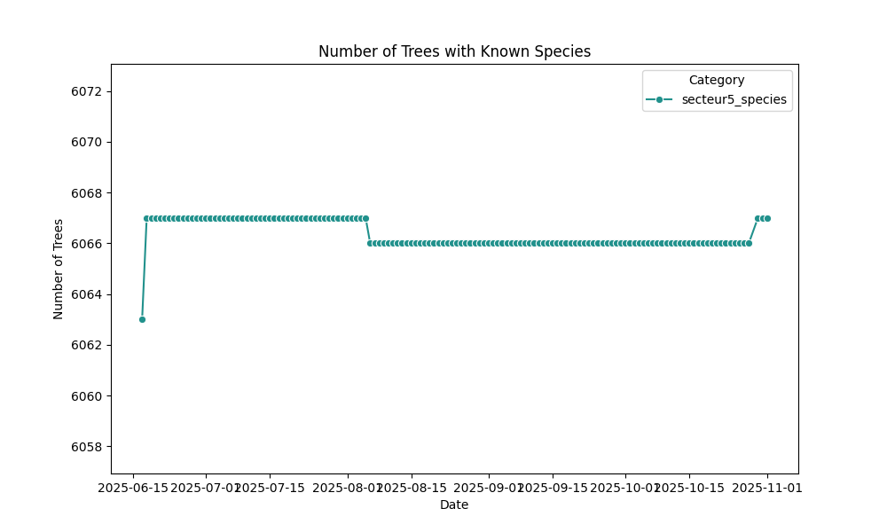
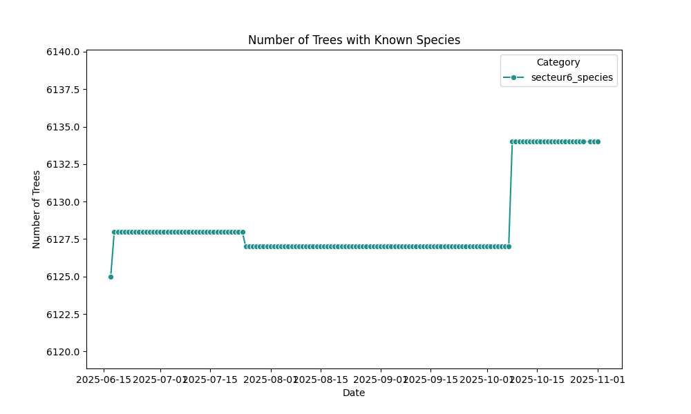
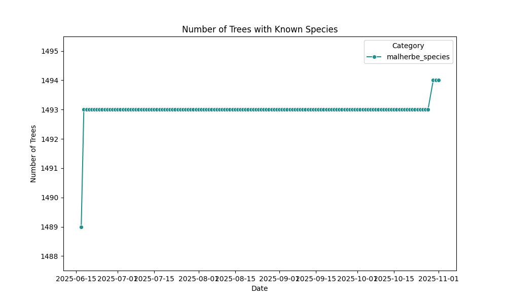
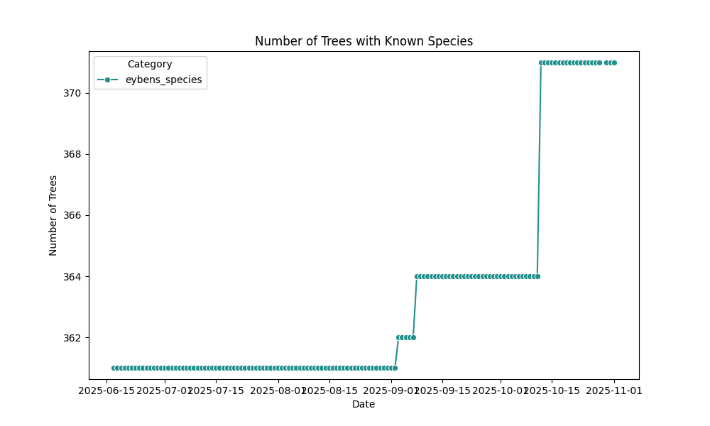

# 🌳 Tracking Tree Species on OpenStreetMap

Welcome! This site presents a series of historical diagrams that trace the evolution of tree species mapping on OpenStreetMap. Our focus is on France and some of its subregions, with data updated automatically every day.

## 📊 Diagram Overview

- **France**: The top diagram shows the growing number of trees with identified species across the country.
- **Auvergne-Rhône-Alpes**: Regional trends in species tagging.
- **Isère**: Department-level insights.
- **Grenoble**: Urban mapping dynamics.
- And more...

Each diagram reflects the cumulative growth of species-tagged trees, helping visualize ecological awareness and mapping precision over time.

---

## France

## Auvergne-Rhône-Alpes
Overpass queries: [with species](https://overpass-turbo.eu/s/2gbc) / [without species](https://overpass-turbo.eu/s/2gbd)

## Isère
Overpass queries: [with species](https://overpass-turbo.eu/s/2gbf) / [without species](https://overpass-turbo.eu/s/2gbg)

## Grenoble-Alpes-Métropole
Overpass queries: [with species](https://overpass-turbo.eu/s/2gbh) / [without species](https://overpass-turbo.eu/s/2gbi)

## Grenoble
Overpass queries: [with species](https://overpass-turbo.eu/s/2gbn) / [without species](https://overpass-turbo.eu/s/2gbo)

### Districts

#### District 1
Overpass queries: [with species](https://overpass-turbo.eu/s/2gbq) / [without species](https://overpass-turbo.eu/s/2gbp)

#### District 2
Overpass queries: [with species](https://overpass-turbo.eu/s/2gbr) / [without species](https://overpass-turbo.eu/s/2gbs)

#### District 3
Overpass queries: [with species](https://overpass-turbo.eu/s/2gbt) / [without species](https://overpass-turbo.eu/s/2gbu)

#### District 4
Overpass queries: [with species](https://overpass-turbo.eu/s/2gbv) / [without species](https://overpass-turbo.eu/s/2gbw)

#### District 5
Overpass queries: [with species](https://overpass-turbo.eu/s/2gbx) / [without species](https://overpass-turbo.eu/s/2gby)

#### District 6
Overpass queries: [with species](https://overpass-turbo.eu/s/2gbz) / [without species](https://overpass-turbo.eu/s/2gbA)

### Neighborhoods

#### Teisseire
Overpass queries: [with species](https://overpass-turbo.eu/s/2gbB) / [without species](https://overpass-turbo.eu/s/2gbC)

#### Malherbe
Overpass queries: [with species](https://overpass-turbo.eu/s/2gbD) / [without species](https://overpass-turbo.eu/s/2gbE)

#### Villeneuve
Overpass queries: [with species](https://overpass-turbo.eu/s/2gbF) / [without species](https://overpass-turbo.eu/s/2gbG)

#### Vigny-Musset
Overpass queries: [with species](https://overpass-turbo.eu/s/2gbH) / [without species](https://overpass-turbo.eu/s/2gbI)

#### Village Olympique
Overpass queries: [with species](https://overpass-turbo.eu/s/2gbJ) / [without species](https://overpass-turbo.eu/s/2gbK)

## Échirolles
Overpass queries: [with species](https://overpass-turbo.eu/s/2gbL) / [without species](https://overpass-turbo.eu/s/2gbM)

## Eybens
Overpass queries: [with species](https://overpass-turbo.eu/s/2gbN) / [without species](https://overpass-turbo.eu/s/2gbP)

## Saint-Martin-d'Hères
Overpass queries: [with species](https://overpass-turbo.eu/s/2gbQ) / [without species](https://overpass-turbo.eu/s/2gbR)

## La Tronche
Overpass queries: [with species](https://overpass-turbo.eu/s/2gbS) / [without species](https://overpass-turbo.eu/s/2gbT)

## Fontaine
Overpass queries: [with species](https://overpass-turbo.eu/s/2gbU) / [without species](https://overpass-turbo.eu/s/2gbV)

## Seyssinet-Pariset
Overpass queries: [with species](https://overpass-turbo.eu/s/2gbW) / [without species](https://overpass-turbo.eu/s/2gbX)

## Seyssins
Overpass queries: [with species](https://overpass-turbo.eu/s/2gbY) / [without species](https://overpass-turbo.eu/s/2gbZ)

