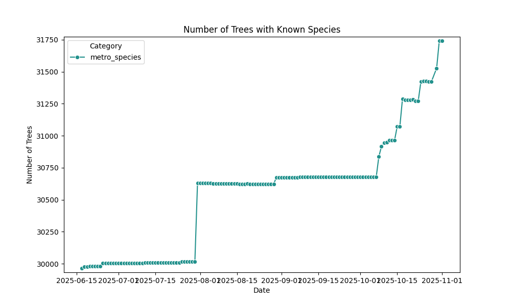
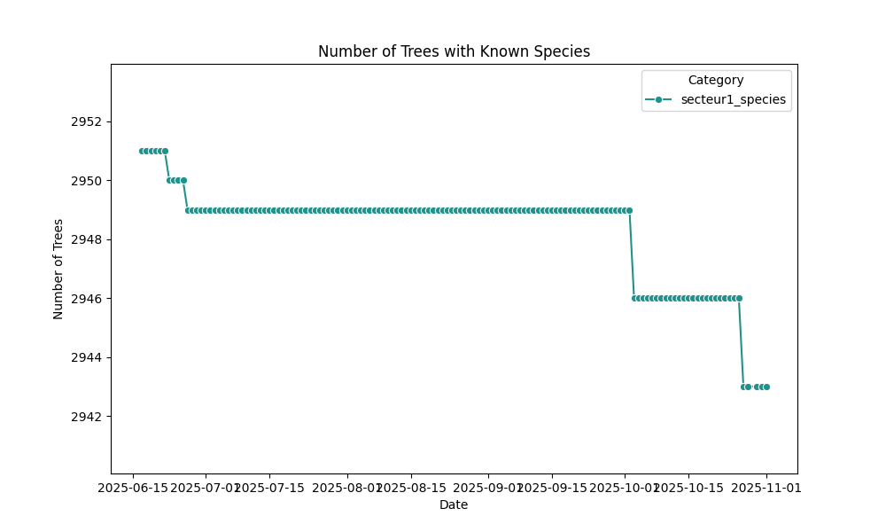
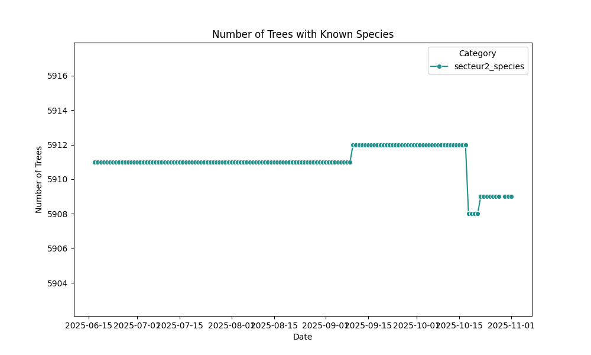
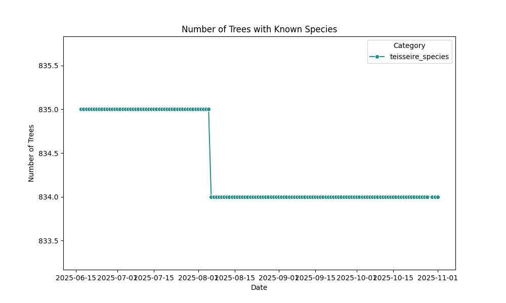
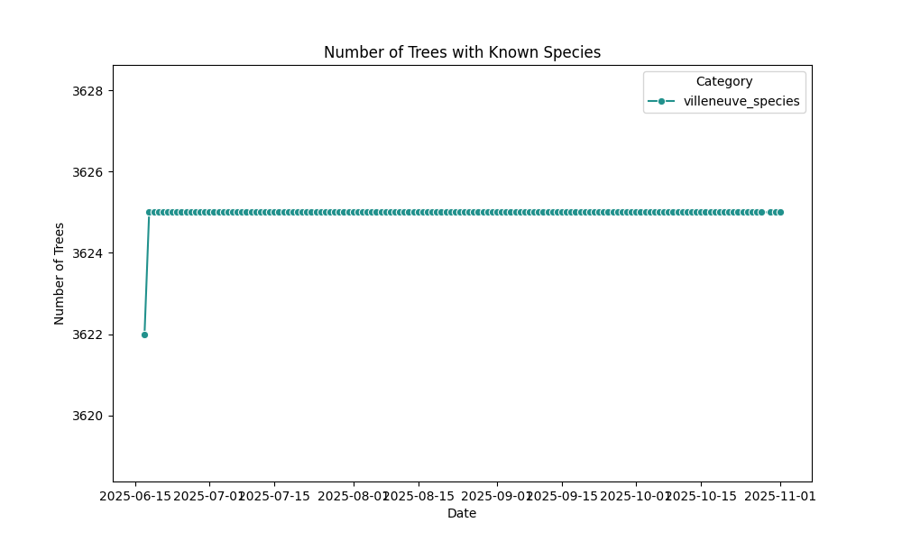
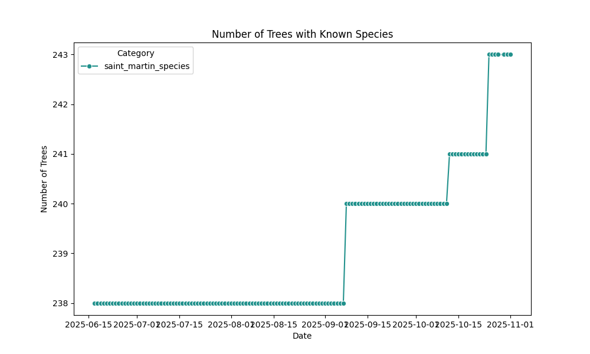
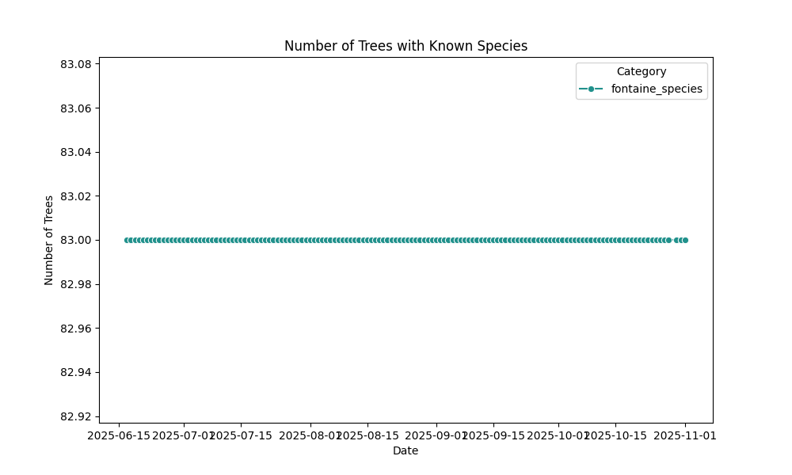
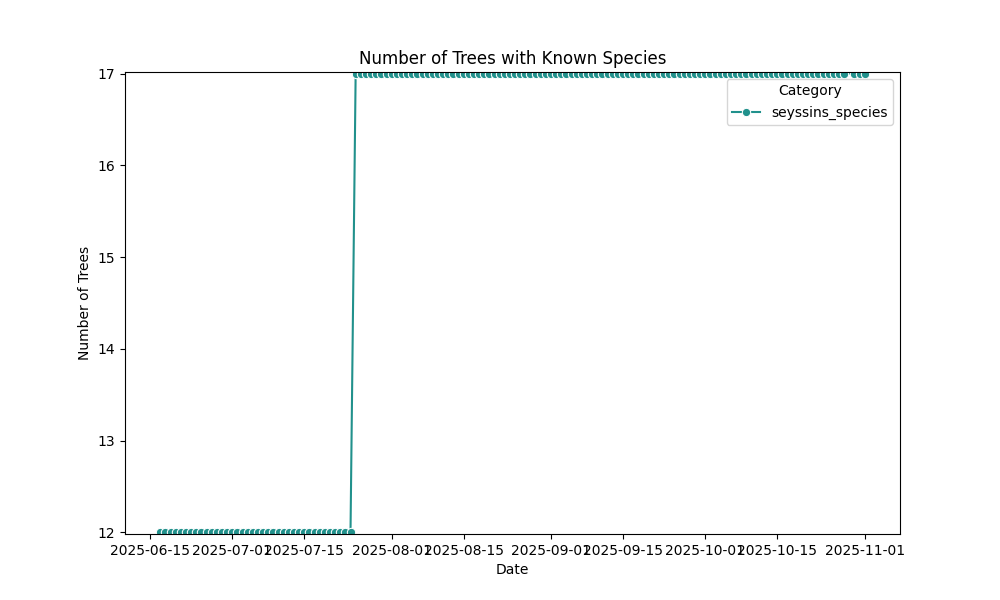

# 🌳 Tracking Tree Species on OpenStreetMap

Welcome! This site presents a series of historical diagrams that trace the evolution of tree species mapping on OpenStreetMap. Our focus is on France and some of its subregions, with data updated automatically every day.

## 📊 Diagrams Overview

- **France**: The top diagram shows the increasing number of trees with known species across the country.
- **Auvergne-Rhône-Alpes**: Regional trends in species tagging.
- **Isère**: Department-level insights.
- **Grenoble**: Urban mapping dynamics.
- etc.

Each diagram reflects the cumulative growth of species-tagged trees, helping visualize ecological awareness and mapping precision over time.

---

## France

## Auvergne-Rhône-Alpes

## Isère

## Grenoble-Alpes-Métropole

## Grenoble

### Secteurs

#### Secteur 1

#### Secteur 2

#### Secteur 3

#### Secteur 4

#### Secteur 5

#### Secteur 6

### Quartiers

#### Teisseire

#### Malherbe

#### Villeneuve

#### Vigny-Muset

#### Village Olympique

## Echirolles

## Eybens

## Saint-Martin-d'Hères

## La Tronche

## Fontaine

## Seyssinet-Pariset

## Seyssins

